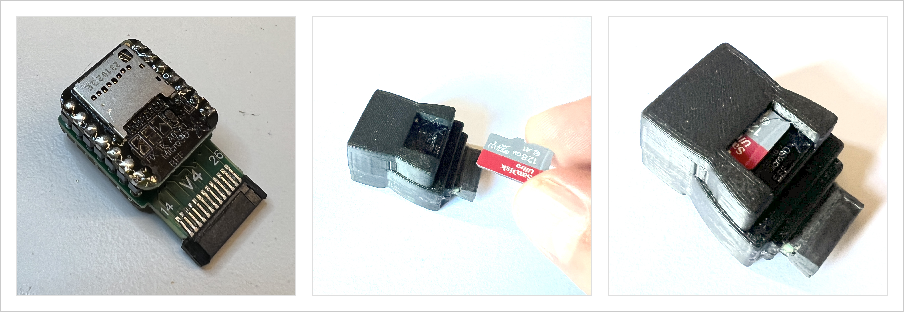
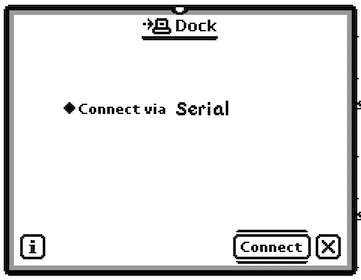

# User Manual
## Newton MessagePad MP2x00 and eMate 300 USB Dongle

The NewtCOM dongle connects the Apple MessagePad MP2x00 and the eMate to a PC
or Mac over USB-C.

The dongle plugs into the rear of the MessagePad or the left side of the eMate.
On the top are two recessed buttons, one for resetting the device, and a second
button to select additional functions.

Two LEDs indicate the current state. The Power LED lights up red when the 
Dongle is either connected to a USB-C port, or when plugged into the Newton
*and* a serial connection is requested.

The Status LED shows the communication status of the Dongle.

 - yellow: idle, waiting for a connection
 - green: an application on the PC or Mac has connected to the Dongle over USB-C
 - blue: the Newton is connected to the Dongle's built-in NCU
 - flashing light blue: the Dongle is reading from the SD Card

### USB-C Port for Data and Power

The USB-C port is located on the back of the dongle. When connected to a PC, it 
typically supplies enough power to operate the Newton with two standard PCMCIA 
cards installed.

However, this may not be sufficient to power WiFi cards or charge the battery pack.

### MicroSD Card Slot

The bottom of the dongle includes a slot for a MicroSD card. To insert or 
remove the card, you must first unplug the dongle from the MessagePad.

When inserting the MicroSD card, make sure the metal contacts face the 
dongle — this is the "up" direction when the dongle is connected to the Newton.

The MicroSD card must be formatted with the FAT32 file system.

> [!TIP]
> The shape of the dongle ensures that it can't be plugged in up-side down.
> Make sure that the interconnect plug is pushed in all the way in for a secure
> connection.

## Serial Mode

The dongle works as a serial connection between the Newton and the PC or Mac,
running any of the common Newton synchronization tools. It has been tested with
NCU, NCX, unixnpi, and NTK. 

Also the low level debugging tool Hammer works fine using the BasiliskII emulator.
Note that older versions of Baslilisk do not support serial port emulation.
These versions should: 
[MacOS](http://messagepad.org/Downloads/Einstein/MacOS/BasiliskII.MacOS,E.2.zip),
[Windows](http://messagepad.org/Downloads/Einstein/MSWindows/BasiliskII.Windows.E.4.zip),
[Linux Ubuntu LTS](https://github.com/pguyot/Einstein/releases/download/v2022.4.17/Einstein_linux_x64_fltk_v2022.4.17.zip).

### USB-C Serial Connection

When the dongle is connected to a modern computer via USB-C, it appears 
as a serial port.

 - On macOS and Linux, it will show up as something like 
   `/dev/cu.usbmodem83201` (the exact number may vary).
 - On Windows, look for a COM port such as `\\.\COM5` or similar in your 
   device manager.

###  Transfer Speed

The communication speed is controlled by the computer. For example, NCX can be 
set to use a faster transfer rate like 115,200 bps instead of the default 
38,400 bps. If you choose a higher speed, be sure the "Serial 11200" Dock 
package is installed on the Newton.

The dongle automatically adjusts to the speed set by the computer. If no 
computer is connected, it defaults to 38,400 bps.

### Flow Control

The NewtCOM dongle uses Newton-style hardware handshaking and includes 
internal throttling to ensure smooth, reliable data transfer.

> [!TIP]
> If transfer of large files still occasionally hangs during transfer, the 
> throttling parameters can be adapted using Hayes commands (see below). 
> The default values are an educated guess. Please let me know if you find
> better values that work for every configuration.

## Dock mode (Firmware v0.6 and later)

Version 0.6 of the firmware implements parts of the Newton Docking protocol to
emulate a minimal NCU app inside the dongle. 

To use this feature, prepare a MicroSD card
by copying `.pkg` package files onto the card. Folders are fully supported. 
Don't put more than 50 files or folders into a directory.

Put the SD Card into the MicroSD slot on the bottom of the dongle. Connect the 
dongle to your Newton. It does not matter if the dongle is also connected via
USB as long as no app on the PC is trying to connect (NCX, NCU, etc.). The LED
should show yellow.

Launch `Dock` on your Newton. Set the port to `Serial` at 38'400 bps. Tap 
`Connect`. After 4 or 5 seconds, the LED changes to blue and your Newton
should show the Docking window with a single option to browse the SD Card. 
Tap the icon and a list of files and folders on your SD Card should appear.

Tap on a package, the tap `Install`, an the Newton will download and install
the package.

Firmware version 0.6 introduces basic support for the Newton Docking protocol. 
This allows the dongle to emulate a minimal NCU-like app, enabling package 
installation directly from a MicroSD card—no computer required.

### Preparing the MicroSD Card

 - Copy your .pkg files to the MicroSD card.
 - You can organize them into folders; subfolders are fully supported.
 - For best performance, limit each directory to no more than 50 files or folders.
 - The card must be formatted as FAT32.

### Using Dock Mode

 - Insert the MicroSD card into the slot on the bottom of the dongle.
 - Connect the dongle to your Newton. (It can also be connected to a computer 
   via USB, but no app like NCX or NCU should be actively using the port.)
 - The LED on the dongle should light up yellow, indicating it's ready.
 - On your Newton, open the Dock app.
 - Select `Serial` as the connection method, effectively setting the speed to 38,400 bps.
 - Tap Connect. After 4–5 seconds, the LED will change to blue, and a Docking 
   window should appear with an option to browse the SD card.
 - Tap the icon to view a list of files and folders.
 - Select a package, tap Install, and the Newton will download and install 
   it directly from the card.

> [!TIP]
> If no SD Card is in the slot, or NewtCOM can't read the SD Card for some
> other reason, the name of the card will be "Error". Try to reset the dongle.
> If that does not help, remove power from the dongle and start over. If that
> still doesn't help, try another SD Card.

## Updating Firmware

All official releases of the firmware will be published [here](https://github.com/MatthiasWM/newt_dongle/releases).

To update the firmware, download the file ending in `.uf2` to your PC. 

To put the dongle into firmware mode:

- disconnect the dongle from the Newton
- connect the dongle to your PC or Mac via USB-C 
- get two pointy tools to press the recessed buttons
- press and hold the RESET button
- press and hold the SELECT button
- release the RESET button
- release the SELECT button
- the dongle switches into firmware mode and shows up as a new USB drive `RPI-RP2` on your desktop
- now simply drag and drop the `.uf2` file onto the USB drive
- the USB drive will disappear and the dongle will reboot into the new firmware

## Hayes Command Mode

The NewtCOM dongle can be put into Hayes command mode on both the serial port 
and the USB port. To do this, you will need a terminal program. On the Newton
side, this is commonly `PT100`. The Newton serial port speed defaults to 38'400bps. 

There are many VT100 or simpler terminal programs for PCs 
and Macs. The dongle shoud be listed as `/dev/usbmodemXXX` where XXX is 
some random number. The dongle will adapt to the serial port speed set by the PC.

To get into Hayes mode, don't send any data for at least one second. 
Then, within a second, type `+++` (three plus characters - on PT100, you can
create a macro for that - don't press Return). After yet another second 
without any data, the dongle will reply with `OK`. 

You are now in Hayes mode. To get back online, type `ATO` (the letter "O", 
like Online). The dongle replies `CONNECT` and leaves Hayes mode.

There are few Hayes commands at this point, but there will be more:

- `ATO` : go back online
- `ATIn` : get information about the firmware and the firmware version number, n can be 0, 1, or 2.
- `AT&W` : write current settings to Flash memory
- `ATS12=n` : set the Escape Code guard time in n times 1/50th of a second
- `ATS300=n` : set the MNP throttle delay to n microseconds (defaults to 400)
- `ATS301=n` : set an additional delay in number of characters (defaults to 8)
- `AT[GL` : get the SD Card label

 
 
