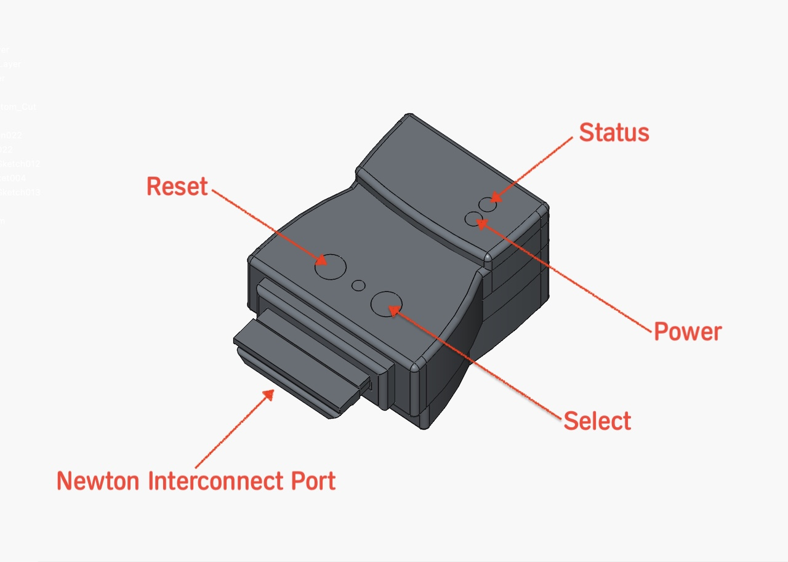
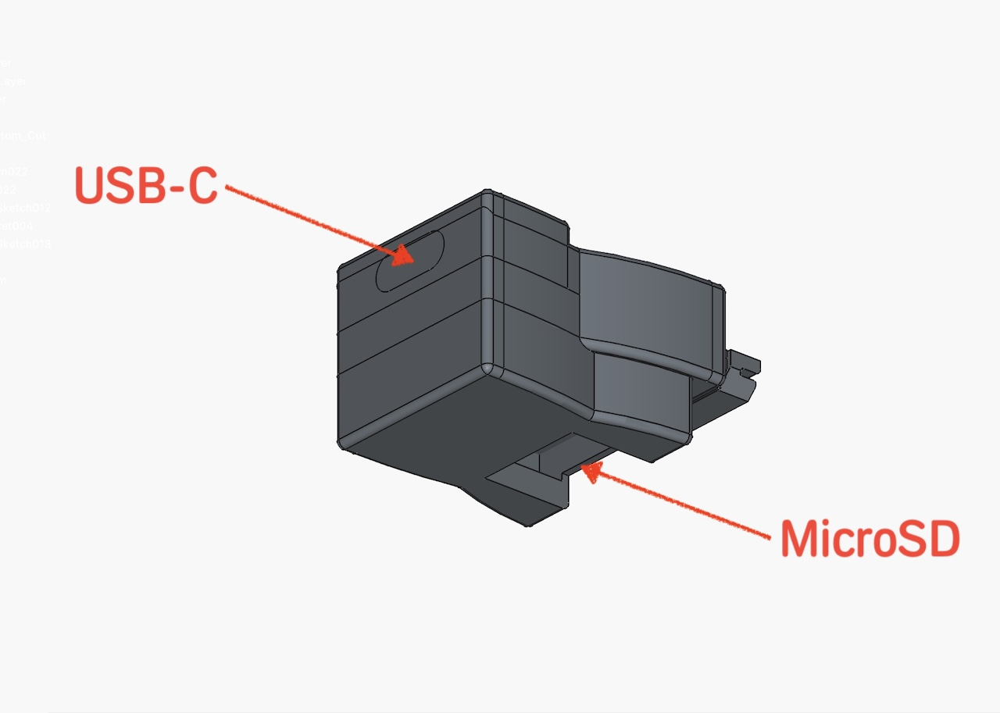

# User Manual
## Newton MessagePad MP2x00 and eMate 300 USB Dongle

The NewtCOM dongle connects the Apple MessagePad MP2x00 and the eMate to a PC
or Mac over USB-C.

The dongle plugs into the rear of the MessagePad or the left side of the eMate.
On the top are two recessed buttons, one for resetting the device, and a second
button to select additional functions.

Two LEDs indicate the current state. The Power LED light up red when the 
Dongle is either connected to a USB-C port, or when plugged into the Newton
*and* a serial connection is requested.

The USB-C port is located in the back. The bottom of the dongle has a slot that
can hold a MicroSD Card.

> [!TIP]
> The shape of the dongle ensures that it can't be plugged in up-side down.
> Make sure that the interconnect plug is pushed in all the way for a secure
> connection.

## Serial Mode

The dongle works as a serial connection between the Newton and the PC or Mac,
running any of the common Newton synchronization tools. It's tested with
NCU, NCX, unixnpi, and NTK. Hammer and other tools should work too.

The transfer speed is set by the PC. If NCX for example is configured to run
at 115'200bps instead of the standard 38'400bps, the dongle will adapt to it.

The NewtCOM dongle uses the Newton hardware handshake and also throttles the 
data transfer to avoid hick-ups. 

> [!TIP]
> If transfer of large fill still occasionally hangs during transfer, the 
> throttling parameters can be adapted using Hayes commands (see below). 
> The NewtCOM dongle is a new product. Any help to get the right values for
> all is greatly appreciated.

## Updating Firmware

All official releases of the firmware will be published [here](https://github.com/MatthiasWM/newt_dongle).

To update the firmware, download the file ending in `.uf2` to your PC. 

To put the dongle into firmware mode:

- disconnect the dongle from the Newton
- connect the dongle to your PC or Mac via USB-C 
- to do the firmware update dance, get two pointy tools to press the recessed buttons
- press and hold the RESET button
- press and hold the SELECT button
- release the RESET button
- release the SELECT button
- the dongle switches into firmware mode and show up as a new USB drive on your desktop
- now simply drag and drop the `.uf2` file onto the USB drive
- the USB drive will disappear and the dongle will reboot into the new firmware

## Hayes Command Mode

The NewtCOM dongle can be put into Hayes command mode on both the serial port 
and the USB port. To do this, you will need a terminal program. On the Newton
side, this is commonly `PT100`. Baud rate must be at 38'400bps'. 
There are an endless number of VT100 or simpler terminal programs for PCs 
and Macs.

To get into Hayes mode, don;t send any data for at least one second. 
Then, within a second, type `+++` (three plus characters - on PT100, you can
create a macro for that). After yet another second without any data, the 
dongle will reply with `OK`. 

You are now in Hayes mode. To get back online, type `ATO` (the letter "O", 
like Online). The dongle replies `CONNECT` and leaves Hayes mode.

There are fe Hayes commands at this point, but there will be more:

- `ATO` : go back online
- `ATI0` : get information about the firmware and the firmware version number
- `ATS300=n` : set the MNP throttle delay to n microseconds (defaults to 400)
- `ATS301=n` : set an additional delay in number o characters (defaults to 8)

Future versions of the firmware will be able to save these setting in NVRAM,
and they will be kept when the dongle is powered down.  

 
 
