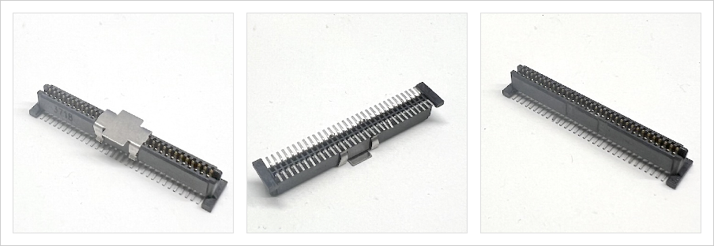
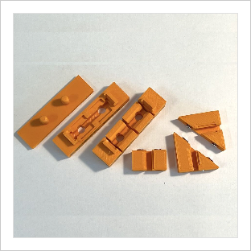
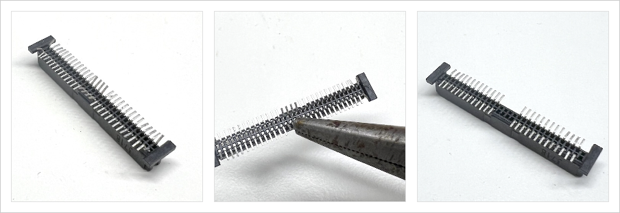

# Hardware supported by NewtCOM firmware

As of May 2025, `NewtCOM` supports  the RP2040 base NewtCOM Dongle. 

## The NewtCOM Dongle

The design of the dongle is OpenSource and I encourage anyone with sufficient 
soldereing skills to build their own dongle. There is a base dongle that 
converts the Serial Port signals on the Interconnect port to USB-C. Optionally,
the dongle can convert the 5V form the USB-C to 7V to run the Newton. There
is also an option for a MicroSD card slot for installing software without
needing a PC, and eventually for making backups and restoring teh content of 
the MessagePad or eMate.

So here is how you build one:

Parts:

- Interconnect Port connector (TODO: insert link)
- RS422 circuit board (TODO: insert link)
- XIAO RP204 circuit board (TODO: insert link)
- optional: Pololu DC-DC power converter (TODO: insert link)
- optional: MicroSD card board (TODO: insert link)
- various pin headers (TODO: insert link)
- 3d printed case (TODO: insert link)

Tools:

- Soldering iron and solder wire
- Hot air gun and SMD solder paste
- multimeter
- needle nose pliers
- wire cutter
- 3d printed jigs

## Step by step

### Ordering the RS422 circuit board

The PCB design can be dowloaded for [oshwlab.com](https://oshwlab.com/matthiasm/interconnecttousb_copy_copy_copy). The PCB can be manufactured based on these
files. Some services (I used JLCPCB) offer the complete assembly for a low rate
if you can't sodler SMDs, especially the tiny diodes.

### Preparing the Interconnect Port connector

#### IEEE 1386

The original Interconnect Port connector is no longer manufactured. We are 
helping ourselves with a havily modified IEEE 1386 connector. One Molex 
71439-0964 (Mouser 538-71439-0964) yields two Newton connectors.

Note that after cutting these to pieces, they wil not be as strong as the 
originals, and I have not found a way to cut the shielding. For normal use, this
should not matter.

This is the standard Molex IEEE 1386 connector. Remove the metal cap (that's
only needed for pick'n'place machines) and make sure the pins on the bottom are not bent out of shape.

#### Jigs

After cutting and filing a few connectors by hand, I decided to build jigs that make this work really easy. The STL files to print the jigs are [here](/3d-parts/jigs/). I printed the jigs with a 0.4mm nozzle at 0.2mm layer height.

#### Prebend

We need to remove 12 pins from the connector. Our (Prebend Jig)[/3d-parts/jigs/Connector_Prebend_Jig.stl] bends those pins that must be removed. Just push the connector all the way into the opening. Use the ejector to remove the connector again.

The jig will bend the pins that need to be remove up slightly. Take your needle nose pliers out and remove the first pin, the four center pins, and the last pin on each side, so 12 pins alltogether. We should have two groups
of pins now on either side with 13 pins per row, or 26 pins per group.

TODO: write me!
- cut
- file sides
- file diagonals
- final bend of pins

### Soldering the connector

TODO: write me!
- hot air gun
- visual test, multimeter test

### Soldering the RS422 board to the RP2040 board

TODO: write me!
- Solder board to board if no MicroSD board will be mounted
- Solder with 10mm pins if SD card slot is wanted
- visual test, multimeter test

### Optional: adding the DC-DC converter

TODO: write me!
- 3 pin header to PCB, converter hovers under the board
- visual test, multimeter test

### Optional: adding the MicroSD board

TODO: write me!
- solder PCB to teh bottom of the module
- visual test, multimeter test

### Flashing the Firmware

TODO: write me!
- USB Drive mode
- drag and drop

### Testing the dongle

TODO: write me!
- test power from interconnect port
- test power from USB-C
- test power to Newton
- Hayes mode, AT commands
- practical tests: NCX, Basilisk and NCU
- practical test SD Card

### Putting everything in a case

TODO: write me!
- choose a case
- print the case
- glue

