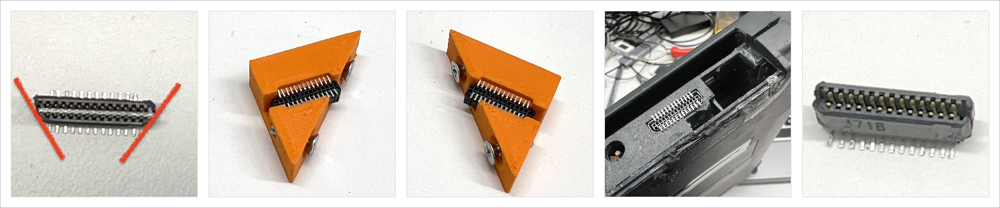
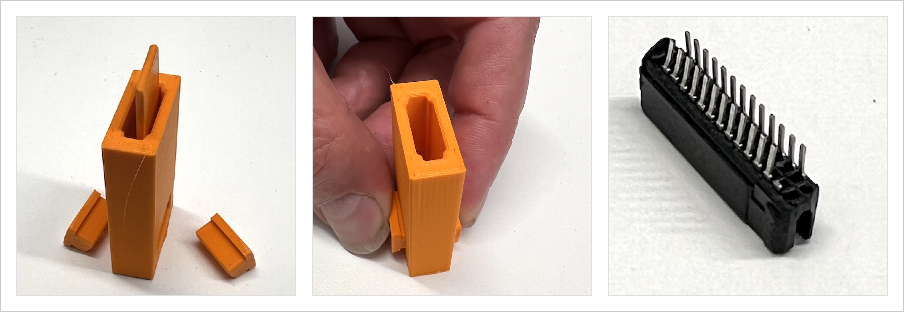

# Hardware supported by NewtCOM firmware

As of May 2025, `NewtCOM` supports  the RP2040 base NewtCOM Dongle. 

## The NewtCOM Dongle

The design of the dongle is OpenSource and I encourage anyone with sufficient 
soldereing skills to build their own dongle. There is a base dongle that 
converts the Serial Port signals on the Interconnect port to USB-C. Optionally,
the dongle can convert the 5V form the USB-C to 7V to run the Newton. There
is also an option for a MicroSD card slot for installing software without
needing a PC, and eventually for making backups and restoring teh content of 
the MessagePad or eMate.

So here is how you build one:

Parts:

- Interconnect Port connector (TODO: insert link)
- RS422 circuit board (TODO: insert link)
- XIAO RP204 circuit board (TODO: insert link)
- optional: Pololu DC-DC power converter (TODO: insert link)
- optional: MicroSD card board (TODO: insert link)
- various pin headers (TODO: insert link)
- 3d printed case (TODO: insert link)

Tools:

- Soldering iron and solder wire
- Hot air gun and SMD solder paste
- multimeter
- small needle nose pliers
- small hacksaw
- electronics wire cutter
- 3d printed jigs

## Step by step

### Ordering the RS422 circuit board

The PCB design can be dowloaded for [oshwlab.com](https://oshwlab.com/matthiasm/interconnecttousb_copy_copy_copy). The PCB can be manufactured based on these
files. Some services (I used JLCPCB) offer the complete assembly for a low rate
if you can't sodler SMDs, especially the tiny diodes.

### Preparing the Interconnect Port connector

#### IEEE 1386

The original Interconnect Port connector is no longer manufactured. We are 
helping ourselves with a havily modified IEEE 1386 connector. One Molex 
71439-0964 (Mouser 538-71439-0964) yields two Newton connectors.

Note that after cutting these to pieces, they wil not be as strong as the 
originals, and I have not found a way to cut the shielding. For normal use, this
should not matter.

This is the standard Molex IEEE 1386 connector. Remove the metal cap (that's
only needed for pick'n'place machines) and make sure the pins on the bottom are not bent out of shape.

#### Jigs

After cutting and filing a few connectors by hand, I decided to build jigs that make this work really easy. The STL files to print the jigs are [here](/3d-parts/jigs/). I printed the jigs with a 0.4mm nozzle at 0.2mm layer height.

#### Prebend

We need to remove 12 pins from the connector. Our (Prebend Jig)[/3d-parts/jigs/Connector_Prebend_Jig.stl] bends those pins that must be removed. Just push the connector all the way into the opening. Use the ejector to remove the connector again.

The jig will bend the pins that need to be remove up slightly. Take your needle nose pliers out and remove the first pin, the four center pins, and the last pin on each side, so 12 pins alltogether. We should have two groups
of pins now on either side with 13 pins per row, or 26 pins per group.

#### Cut

Use the cutting jig and the small hacksaw to cut the original connector into two new connectors. Three cuts are needed.

#### File Sides

The Interconnect Port connector must be 15.6mm wide. File the plastic off of our part evenly on both ends until you reach the desired width. The jig can help, but the 3mm bolts must be adjusted to the correct distance.

*Don't* bend any pins.

#### File Corners

To ensure that the connector is not inserted upside down, the corners on the bottom must be filed to 45 degrees. Again, the two jigs for left and right should help. Make sure that you file the corners on the *same* side.

*Don't* bend any pins.

The last image show a test fit in a MessagePad. The connector should fit snug, but not stuck. Did I mention to not bend any pins? Well, if you did, and you did bend them back too many times, they probably broke off by now. Throw away the connector and try again.. 

#### Final Bend

This step is the most difficult one. The connectors tend to break if done incorrectly. So I developed a jig that makes this step much easier. 

Insert teh pulg into the top of the bender. Insert the plunger between the pin rows and push it all the way down.

Remove the plunger and grab the two pistons. Without lifting the jig, push the two pistons into the side openings (the slant faces down). Remove the plug. The pins are now bent away from the plug without damaging the plug's case. It's ready to be soldered to the RS422 interface board.

### Soldering the connector

Position the connector correctly on the RS422 board. The first two images show the *bottom* of the board. Make sure that the 45 degree corners are on the *bottom* side of the PCB. The third image show the *top* of the PCB with no parts on it. The connector must have the 90 degree corners on the top!

Look at the PCB from the side: the connector must be straight with the PCB, not pointing up or down.

Soldering is easy with some fresh solder paste and a hot air gun. Just add a small bead and heat one side of the connector until the solder balls disappear and teh solder is shiny. The pin distance it 1mm. It's also relatively easy to solder this with a regular soldering iron, flux, and a fine tip.

Did you solder the connector on the right way? Did you make sure the 45 degree corners are on the side where the parts are?

Let's do a mechanical check first. Here we see the RS422 board plugged into my MessagePad (it's a very roughly used MP, sorry for the scratches). The left photo show the top view, the right photo is taken from the bottom.

If you are unsure about your soldering, use a multimeter to check for shorts between pins.  Pin 15 and 16 are connected and will show a short circuot correctly. The remaining neighbors should show a high resistance.

### Soldering the RS422 board to the RP2040 board

TODO: write me!
- Solder board to board if no MicroSD board will be mounted
- Solder with 10mm pins if SD card slot is wanted
- visual test, multimeter test

### Optional: adding the DC-DC converter

TODO: write me!
- 3 pin header to PCB, converter hovers under the board
- visual test, multimeter test

### Optional: adding the MicroSD board

TODO: write me!
- solder PCB to teh bottom of the module
- visual test, multimeter test

### Flashing the Firmware

TODO: write me!
- USB Drive mode
- drag and drop

### Testing the dongle

TODO: write me!
- test power from interconnect port
- test power from USB-C
- test power to Newton
- Hayes mode, AT commands
- practical tests: NCX, Basilisk and NCU
- practical test SD Card

### Putting everything in a case

TODO: write me!
- choose a case
- print the case
- glue

